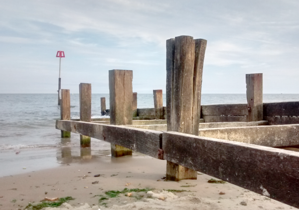

# Moore-Neighbourhood Contours 

This is a Go programme for pulling out contours/regions from an image.

It uses Moore-Neighbourhood contour tracing. For more details on the algorithm/approach see [this site](http://www.imageprocessingplace.com/downloads_V3/root_downloads/tutorials/contour_tracing_Abeer_George_Ghuneim/moore.html).

## Status

Forked from [Ben Foxall's project](https://github.com/benfoxall/contours) in March 2024,
and translated from Javascript to Go.

## Usage

    $ mncontours thingy.png

will create a file called thingy-mnc-t128m15A4L.svg.  The numbers in the output SVG file name indicate
the default values of the threshold, margin, and paper options.

### Options

* `-t value,...`
Specify one or more threshold values, separated by commas, each in the range 0..255.  These are the pixel
values that are used to find the contours.  Default `128`. Examples: `-t 99` `-t 32,64,96,128,160,192,224`

* `-m margin`
Define the minimum width, in mm, of the margin around the created image.  Default 15.  Example: `-m 10`

* `-p paper`
Choose the paper size to use.  One of A4L, A4P, A3L, or A3P.  Default A4L. Example: `-p A3L`

## Examples

`mncontours beach.png -t 32,64,96,128,160,192,224` produces this:

 

### Issues

* A non-closed thin shape such as test7.png has to look at the shape from both sides to find the whole contour,
  but then ends up with repeated pixels or, if those are excluded, pixels out of order.
